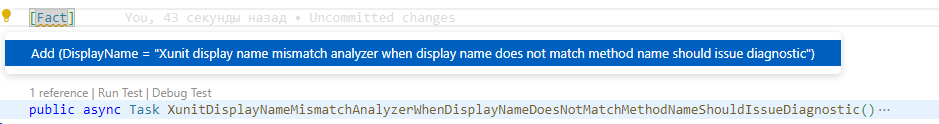
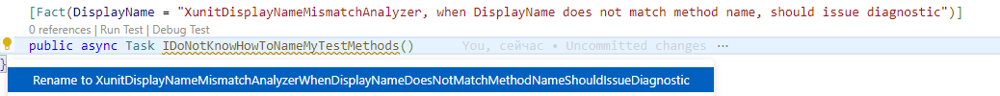

# FactCheck

FactCheck is a Roslyn analyzer that enforces human-readable unit test descriptions in .NET projects

## Why do I need it?

It makes your unit test reports look nicer.

In xUnit, the most popular .NET test framework, the attributes Fact and Theory accept the optional argument DisplayName:

```csharp
[Fact(DisplayName = "System Under Test, when Condition is present, should exhibit Behavior")]
public void SystemUnderTest_WhenConditionIsPresent_ShouldExhibitBehavior()
{
    /* … */
}
```

This attribute sets the human-readable name for the fact or theory you're testing.

Most IDE's and test reporting tools honor this attribute and use it to report passed and failed tests.

It works in Visual Studio, Rider, Bamboo test parser, `dotnet test` CLI command, etc.:

```sh
# dotnet test --list-tests

Microsoft (R) Test Execution Command Line Tool Version 17.3.0 (x64)
Copyright (c) Microsoft Corporation.  All rights reserved.

The following Tests are available:
     XunitDisplayNameMismatchAnalyzer, when DisplayName does not match method name, should issue diagnostic
    XunitDisplayNameMissingAnalyzer, when DisplayName is provided on Fact, should not issue diagnostic
    XunitDisplayNameMissingAnalyzer, when qualified name is used, should not issue diagnostic
    XunitDisplayNameMissingAnalyzer, when attribute string is not trimmed, should not issue diagnostic
    XunitDisplayNameMissingAnalyzer, when DisplayName is not provided on Fact, should issue diagnostic
    XunitDisplayNameMissingAnalyzer, when DisplayName is not provided on Theory, should issue diagnostic
    SplitCode, when given code, should split(input: "lowercase", expectedOutput: ["lowercase"])
    SplitCode, when given code, should split(input: "Initcap", expectedOutput: ["Initcap"])
    SplitCode, when given code, should split(input: "UPPERCASE", expectedOutput: ["UPPERCASE"])

```

## How do I install it?

```bash
dotnet add package FactCheck
```

## How does it work?


FactCheck checks that DisplayName attribute is set on all fact and theory methods.

### Missing DisplayName attribute

If the attribute is not set, it displays a hint and offers a fix to set the attribute from the method name:




, or using the CLI:

```sh
dotnet format analyzers --diagnostics=FACTCHECK0001
```

### Method name mismatch

If the method name does not match the human-readable name, FactCheck displays a hint and offers a fix to rename the method:



, or using the CLI:

```sh
dotnet format analyzers --diagnostics=FACTCHECK0002
```

